OpenTimestamps is an scalable, trustless, distributed protocol to timestamp files, documents and media on Bitcoin.
There are available clients, documentations, tools and libraries in different languages, for more info look at [GitHub](https://github.com/opentimestamps). 
Moreover (OpenTimestamps website](https://opentimestamps.org) provides free and easy methods to stamp and verify my documents.
In this tutorial, I want to allow lazy people, as me, to automatically stamp documents in the cloud without any human interaction by using Amazon Lambda functions:
when I transfer a file in my Amazon S3 cloud storage, the Lambda function stamps the document and stores the proof-file on the S3 itself.
> Note: I suggest to run your own Amazon Lambda function, because you should not trust to any third-party service.

### Why AWS Lambda?

With Amazon AWS Lambda, you pay only for the compute time you consume, there is no charge when your code is not running. With Lambda, you can run code for virtually any type of application or backend service, all with zero administration. 

A full guide of AWS Lambda is available at [https://docs.aws.amazon.com/lambda/latest/dg/lambda-dg.pdf](https://docs.aws.amazon.com/lambda/latest/dg/lambda-dg.pdf) .

### Get started
To create an AWS Lambda Function go to the list of `Services` and select `Lambda`: Run Code without Thinking about Server.

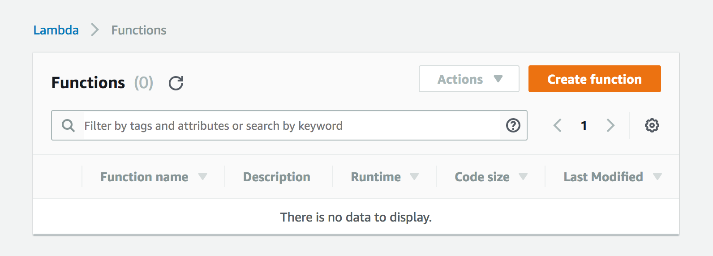

Create function from scratch: select name, node.js as runtime, select the existing role `lambda_basic_execution` and press `Create function`.

### Connect to S3 bucket
I build and configure my S3 bucket previously with 2 main folders: 
* `uploads`: store files
* `proof`: store OTS proof-files

In the Designer, select S3 voice to import your S3 bucket

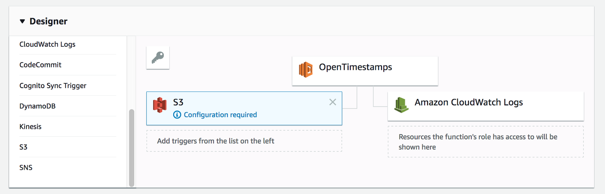

Configure S3 bucket to enable Triggers

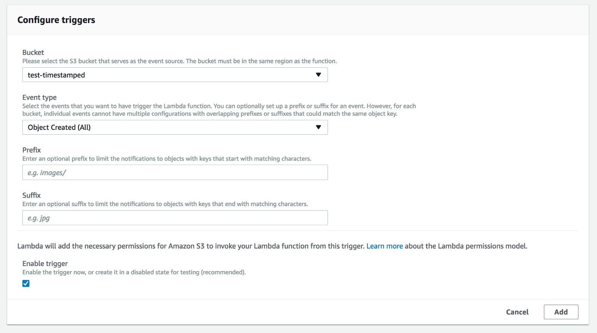

Press the orange button `Save` in the top-right of the page to save your current setting.

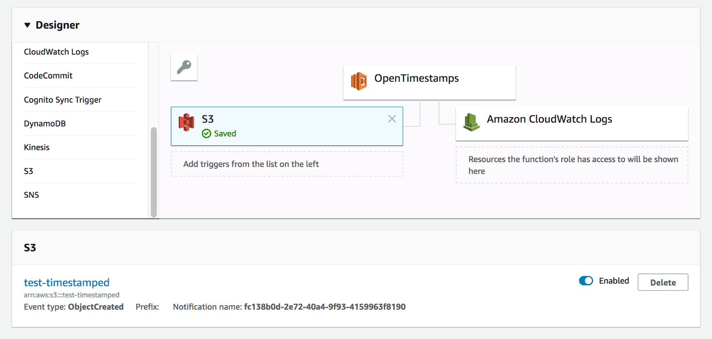

### Write lambda function
In Designer, select OpenTimestamps lambda function to view `Function code` panel.

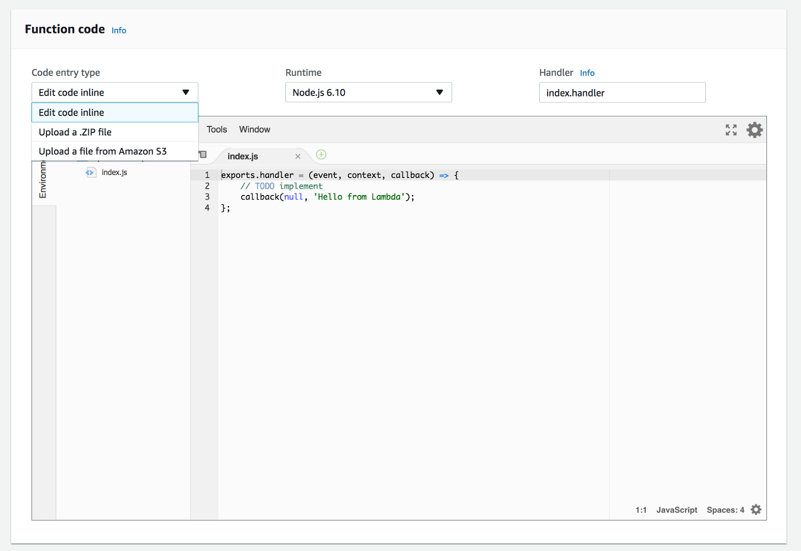

You can write your own script to call OpenTimestamps calendar servers or use OpenTimestamps nodejs library available on npm.
Otherwise, you can find my own script at [https://github.com/lvaccaro/javascript-opentimestamp-awslambda](https://github.com/lvaccaro/javascript-opentimestamp-awslambda).
Download and build a .zip package to upload on your AWS lambda platform. Select Upload a .ZIP file` on function code panel.

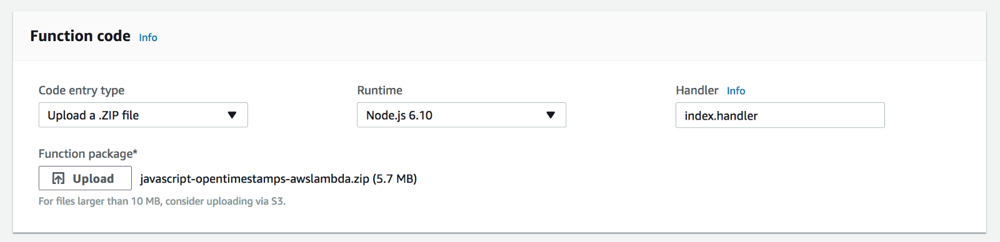

Check the execution role and select `lambda_basic_execution` and increase the Timeout. Keep the other values as default.

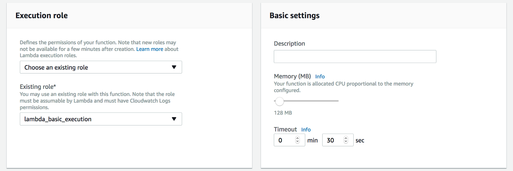

### Set access and roles

Go to Services IAM: Manage User Access and Encryption Keys. 
In Roles menu, click on role `lambda_basic_execution` and attach the following policies: `AmazonS3FullAccess`, `AWSLambdaRole`.
Press `Save` to upload and save your current settings.

### Publish
Click `Actions` and `Publish`: set a version name before publish a new version.

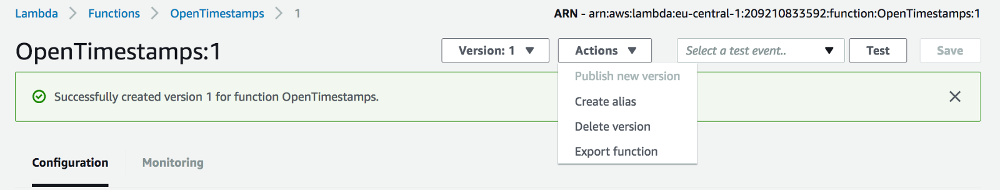

### Run
Go in your S3 bucket. Upload your files on `uploads` folder and automatically our AWS lambda function build the OTS receipt on `proof` folder.

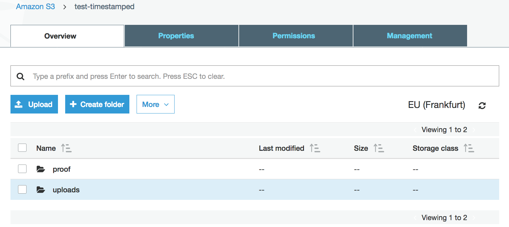

Go to `upload` folder to upload a file

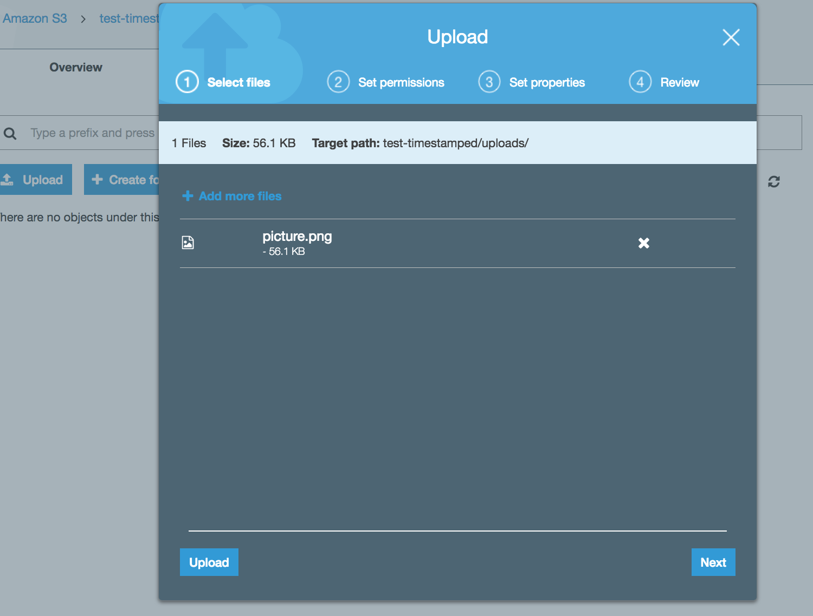

And in the `proof` folder, it is automatically generated and stored the OTS file.

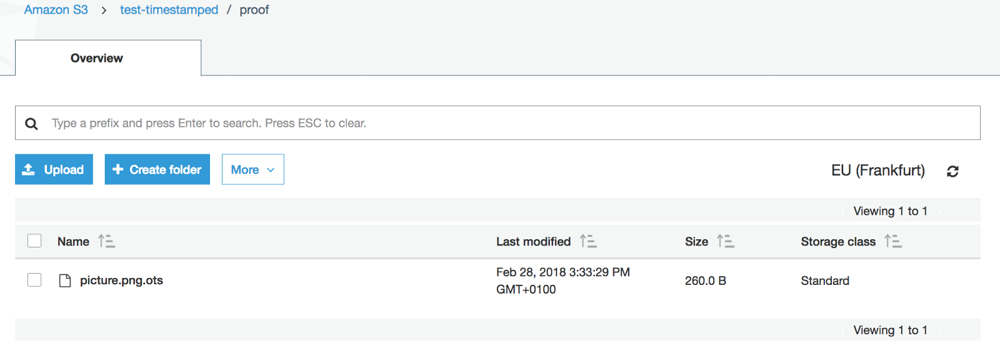

